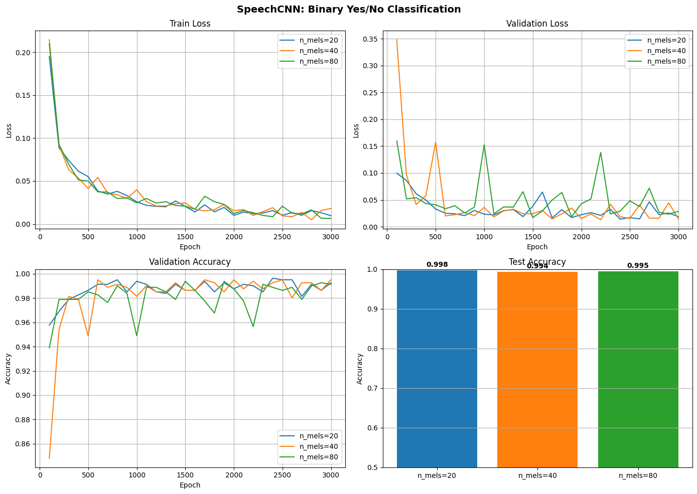
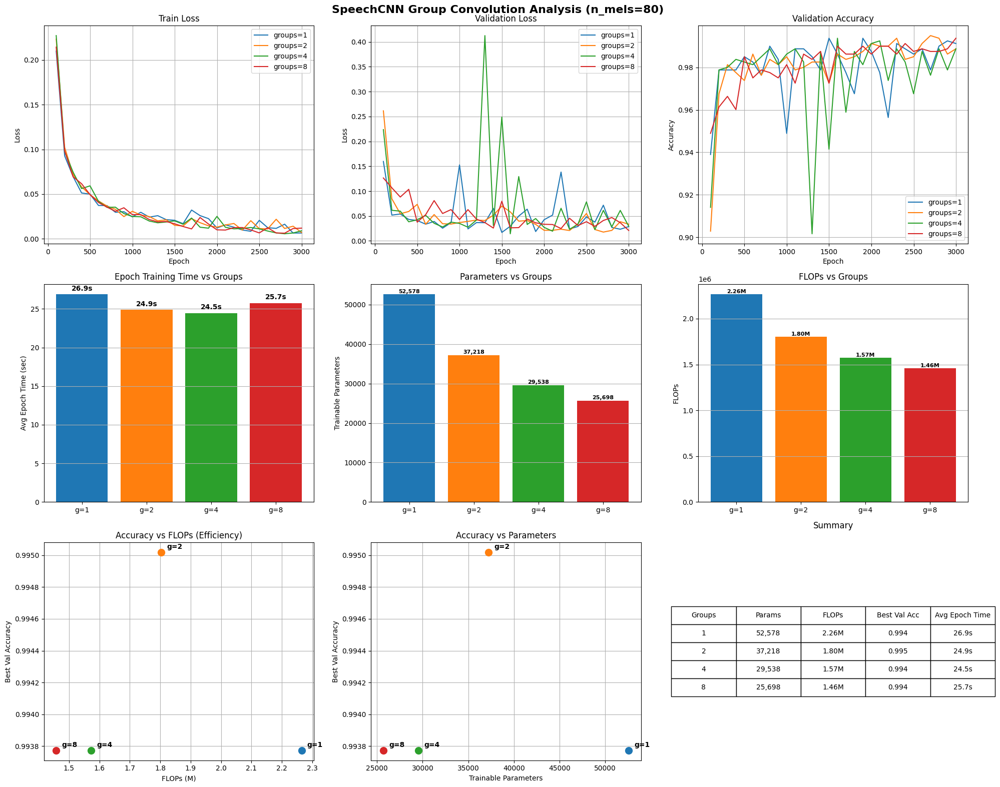

# SpeechCNN for Binary Yes/No Classification on Google Speech Commands

## 1. Comparison of different numbers of mel filterbanks

I first compared three feature settings:

- `n_mels = 20`
- `n_mels = 40`
- `n_mels = 80`

### Main observations

All three models converged quickly. Train loss dropped sharply during the early epochs and then decreased more slowly. Validation accuracy was very high for all settings and stayed close to **0.99** after convergence.

The main difference was in stability:

- **20 mels** gave the strongest final test result,
- **40 mels** also worked well, but did not improve over 20 mels,
- **80 mels** achieved similarly high accuracy, although its validation loss was a bit noisier.

### Test accuracy

- **20 mels:** `0.998`
- **40 mels:** `0.994`
- **80 mels:** `0.995`

### Conclusion for mel comparison

The task is simple enough that even a compact feature representation already works extremely well. Increasing the number of mel filterbanks did not bring a clear accuracy gain. In these experiments, 20 mels achieved the best test accuracy.

For the next stage, I used the 80-mel model as the baseline for the group convolution study, since its performance was still very strong and it provides a richer spectral representation.

## 2. Group convolution experiments (`n_mels = 80`)

In the second part, I fixed `n_mels = 80` and varied the `groups` parameter in `Conv1d`:

- `groups = 1`
- `groups = 2`
- `groups = 4`
- `groups = 8`

### Main observations

Train loss was very similar across all group settings, so all models were able to fit the task well. The bigger difference appeared in validation behavior:

- **groups = 2** gave the best validation accuracy and the most balanced overall behavior,
- **groups = 1** was also strong, but slightly less efficient,
- **groups = 4** and **groups = 8** reduced complexity further, but validation became less stable,
- **groups = 4** showed the strongest validation fluctuations.

### Efficiency trends

Increasing the number of groups reduced both the number of trainable parameters and FLOPs:

- `g=1`: **52,578 params**, **2.26M FLOPs**
- `g=2`: **37,218 params**, **1.80M FLOPs**
- `g=4`: **29,538 params**, **1.57M FLOPs**
- `g=8`: **25,698 params**, **1.46M FLOPs**

Average epoch training time also decreased:

- `g=1`: **26.9 s**
- `g=2`: **24.9 s**
- `g=4`: **24.5 s**
- `g=8`: **25.7 s**

The `g=8` timing is higher than expected, but this run was affected by another computationally intensive background process, so this point should not be misinterpreted.

### Conclusion for group convolution

Group convolution is useful here because it reduces model cost with only a very small effect on quality. The best trade-off in my experiments was **groups = 2**: it improved efficiency compared to the standard convolution while keeping the strongest validation result.

## 3. Final conclusions

A small Conv1d-based CNN with Log-Mel features is more than enough for binary **yes/no** classification on Speech Commands. All tested models stayed well below the parameter limit and reached very high accuracy.

The main conclusions are:

- the binary yes/no task is easy for this model family,
- increasing `n_mels` beyond 20 did not improve final test accuracy,
- group convolution reduced parameters and FLOPs as expected,
- **groups = 2** gave the best efficiency/accuracy balance,
