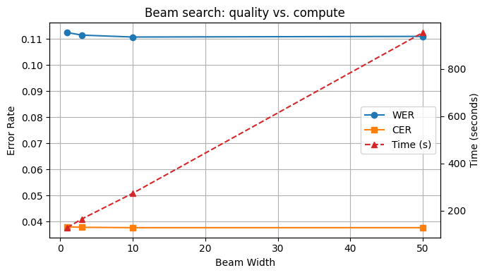
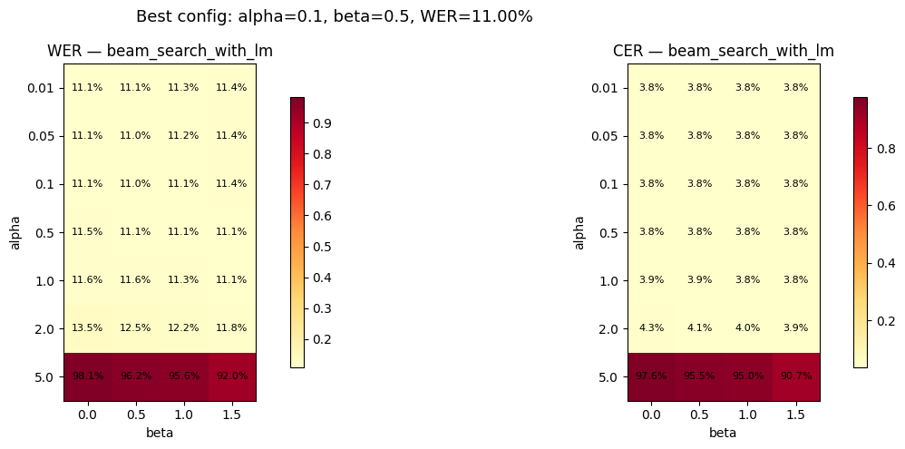
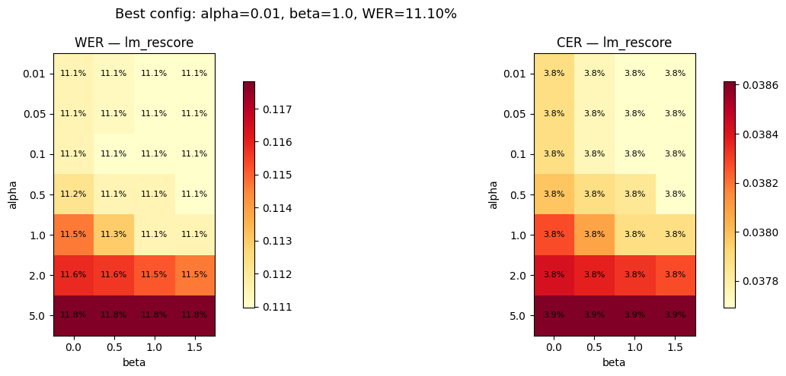
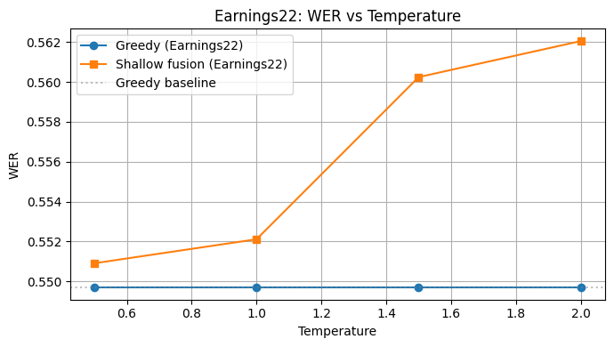

# CTC Decoding and Language Model Integration for Wav2Vec2

## Part 1 - CTC Decoding

### Task 1. Greedy decoding

Evaluation on `data/librispeech_test_other/` (200 samples):

| Method | WER    | CER   |
| ------ | ------ | ----- |
| Greedy | 11.22% | 3.81% |

### Task 2. Beam search decoding

| Method                | WER    | CER   |
| --------------------- | ------ | ----- |
| Greedy                | 11.22% | 3.81% |
| Beam search (width=3) | 11.15% | 3.78% |

#### Beam width sweep

| beam_width | WER    | CER   | Time (s) |
| ---------- | ------ | ----- | -------- |
| 1          | 11.24% | 3.80% | 127.4    |
| 3          | 11.15% | 3.78% | 164.3    |
| 10         | 11.07% | 3.77% | 272.7    |
| 50         | 11.10% | 3.77% | 953.3    |

Beyond width 3 the improvement is very small but compute grows linearly. Width 50 is even slightly worse than 10 - too many beams let unlikely hypotheses compete during pruning.

### Task 3. Temperature scaling

Sweep on `data/librispeech_test_other/` using beam search:

| Temperature | WER    | CER   |
| ----------- | ------ | ----- |
| 0.5         | 11.10% | 3.80% |
| 0.8         | 11.17% | 3.81% |
| 1.0         | 11.15% | 3.78% |
| 1.2         | 11.20% | 3.79% |
| 1.5         | 11.05% | 3.73% |
| 2.0         | 11.17% | 3.75% |

Temperature has no effect on greedy decoding - `argmax` is invariant to monotonic scaling, the top token stays the same for any T > 0. On beam search the effect is very small for in-domain data where the acoustic model is already well-calibrated.

## Part 2 - Language Model Integration

### Task 4. Shallow fusion with 3-gram LM

Scoring: `score = acoustic + alpha * lm_score + beta * num_words`

Alpha/beta sweep on `data/librispeech_test_other/`:

**Best config: alpha=0.1, beta=0.5, WER=11.00%, CER=3.76%**

At alpha=5.0 the LM completely dominates and WER jumps to ~95-98%. The optimal alpha is small (0.1) since the acoustic model is already strong in-domain.

### Task 5. 4-gram LM comparison

Using best alpha=0.1, beta=0.5 from Task 4:

| LM     | WER    | CER   |
| ------ | ------ | ----- |
| 3-gram | 11.00% | 3.76% |
| 4-gram | 11.02% | 3.76% |

Almost no difference. The 3-gram LM is already sufficient for this in-domain task.

### Task 6. LM rescoring

Alpha/beta sweep on `data/librispeech_test_other/`:

**Best config: alpha=0.01, beta=1.0, WER=11.10%, CER=3.77%**

Rescoring is much more stable to large alpha than shallow fusion. At alpha=5.0, rescoring WER is only 11.78% vs 98% for shallow fusion. This is because rescoring only re-ranks acoustically reasonable hypotheses - it cannot steer the search into bad territory like shallow fusion can.

#### Qualitative examples

Some patterns from `task.ipynb`:

- **SF fixes word boundaries** that beam search merges: "doit" to "do it", "themen" to "the men"
- **SF can introduce errors** on rare words: "eyelids" to "iyelids"
- **Rescoring is conservative** - it mostly returns "same WER" since it can only pick from the existing N-best list
- When SF and RS disagree, SF sometimes finds better paths but also sometimes gets misled by early LM-driven pruning

### Task 7. Cross-dataset evaluation

| Method                  | LibriSpeech WER | LibriSpeech CER | Earnings22 WER | Earnings22 CER |
| ----------------------- | --------------- | --------------- | -------------- | -------------- |
| Greedy                  | 11.22%          | 3.81%           | 54.97%         | 25.58%         |
| Beam search             | 11.15%          | 3.78%           | 55.15%         | 25.46%         |
| Beam + 3-gram (shallow) | 11.00%          | 3.76%           | 55.21%         | 25.46%         |
| Beam + 3-gram (rescore) | 11.10%          | 3.77%           | 55.18%         | 25.47%         |

On Earnings22 all methods give ~55% WER. The LibriSpeech LM provides no benefit on financial speech because the vocabulary is completely different (financial jargon, company names, numbers vs audiobook text).

### Task 7b. Temperature sweep on Earnings22

| Temperature | Greedy WER | SF WER |
| ----------- | ---------- | ------ |
| 0.5         | 54.97%     | 55.09% |
| 1.0         | 54.97%     | 55.21% |
| 1.5         | 54.97%     | 56.02% |
| 2.0         | 54.97%     | 56.20% |

Greedy is flat as expected. For shallow fusion, higher T actually hurts on Earnings22 - it gives the mismatched LibriSpeech LM more influence, pushing the decoder further from the correct financial terms. On LibriSpeech T > 1 mildly degrades a well-calibrated model; on Earnings22 T > 1 amplifies the damage of a mismatched LM.
